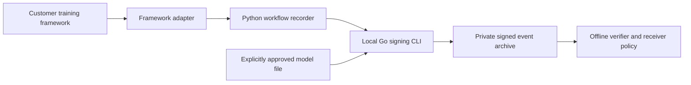

# Universal workflow evidence preview

Apostille workflow evidence is an optional, industry-neutral integration for
customer-owned training and model-delivery workflows. It uses the released
Apostille Core 0.1 producer-only bundle to sign a separate JSON event artifact.
It introduces no new Core protocol, hosted issuer, account, network service or
inference API endpoint.

This is a software preview. The first adapter exercises Flower with synthetic
CPU workloads. NVIDIA FLARE and OpenFL adapters are not implemented. No GPU,
multi-organization deployment, secure aggregation, differential privacy or
pharmaceutical validation is implied by the example.

## Architecture



The framework owns training, aggregation, network security and privacy controls.
The recorder accepts a small allowlist of metadata. Go performs all cryptography
through the pinned Core dependency. Each participant owns its key and archive;
the coordinator does not need participant private keys. Customers export selected
receipts to authorized recipients and independently distribute the receiver
policy. The demo runs these roles on one machine only to test the interfaces.

Apostille Local's existing chat gateway remains an inference service. Workflow
receipts use a separate schema and archive, rather than the gateway's 24-hour
run receipt store. A `deployment_accepted` event records a signer's assertion; it
does not activate a model or grant access through the gateway.

## Event contract

The machine-readable [event schema](../api/workflow-event.schema.json) and
[receiver policy schema](../api/workflow-policy.schema.json) accompany the Go
semantic validator. JSON Schema validation alone does not verify signatures,
producer permissions or archive sequencing.

| Event | Meaning of the signed assertion | Round |
| --- | --- | --- |
| `configuration_approved` | The signer approved an opaque configuration/model reference | Empty |
| `work_completed` | The signer reports its work for this round completed | Positive decimal string |
| `work_failed` | The signer reports its work for this round failed | Positive decimal string |
| `work_cancelled` | The signer reports its work for this round was cancelled | Positive decimal string |
| `model_released` | The signer reports releasing the referenced model | Empty |
| `deployment_accepted` | The signer reports accepting the referenced model | Empty |

All fields are required strings. `schema` is
`urn:apostille:workflow-event:0.1`; `evidence_scope` is
`workflow_metadata_only`. Project, job, agent, event, configuration and model IDs
are opaque UUIDv4 values. A model ID alone does not bind any model file bytes.
`sequence` is a positive decimal string increasing per agent within the project
and job. `framework` and `framework_version` are bounded tokens, not log text.
`artifact_sha256` and `artifact_size` are normally empty.

Only an explicit model-release or deployment-acceptance operation may bind a
local artifact. The CLI's `--artifact` option calculates its exact SHA-256 and
byte count, and fills those two event fields before signing. The input event
must leave them empty, preventing a caller-supplied digest from being mistaken
for a file read by this command. This proves a file binding, not how the model
was trained or whether its contents are safe. Paths and file contents are never
copied into the receipt.

Unknown fields, aliases differing in case, duplicate JSON properties, numeric
values, nulls and invalid event/round combinations are rejected. The event bytes
embedded in the receipt must be canonical. The record contains exactly `event`
and `bundle`; the Core statement binds the embedded event's exact bytes.

## Keys and receiver policy

Build the local CLI:

```sh
make build
```

Create a dedicated signing key in a private directory. This command prints only
the public fingerprint and agent ID; it never prints the seed:

```sh
umask 077
mkdir workflow-private
bin/apostille-workflow keygen \
  --out-key workflow-private/participant.seed \
  --agent-id 00000000-0000-4000-8000-000000000001
```

The private file is a raw 32-byte Ed25519 seed with mode 0600. It is supplied by
path, not by environment, API argument or shell command-line secret. Preserve it
across restarts; test/demo keys are not deployment credentials.

The receiver selects a policy from an independent administrative channel:

```json
{
  "schema": "urn:apostille:workflow-policy:0.1",
  "project_id": "00000000-0000-4000-8000-000000000002",
  "job_id": "00000000-0000-4000-8000-000000000003",
  "producers": [
    {
      "agent_id": "00000000-0000-4000-8000-000000000001",
      "key_id": "sha256:REPLACE_WITH_INDEPENDENTLY_OBTAINED_FINGERPRINT",
      "event_types": ["work_completed", "work_failed", "work_cancelled"]
    }
  ]
}
```

The placeholder fingerprint is deliberately invalid. Provision the real exact
pin outside the receipt delivery channel. Give approval and release permissions
only to appropriate signers; a participant's work permission does not authorize
model release. Policy checks authorize the assertion type. They do not implement
an organization's complete approval workflow, establish legal identity, or
retrieve current key revocation information. Rotate keys through a reviewed
policy update and retain the policy needed for historical verification.

## Python interface

The native SDK supplies `apostille_local.workflow.WorkflowRecorder` with no
additional runtime dependencies. Its CLI executable, key file, policy file,
private archive directory and opaque identifiers are explicit constructor
parameters. It accepts only the supported event type, optional round, and an
explicit artifact path for a release/acceptance operation.

```python
from apostille_local.workflow import WorkflowRecorder

# IDs and paths come from the customer's approved deployment configuration.
recorder = WorkflowRecorder(
    executable="/opt/apostille/bin/apostille-workflow",
    archive_directory="/var/lib/apostille/participant-events",
    key_file="/etc/apostille/participant.seed",
    policy_path="/etc/apostille/receiver-policy.json",
    agent_id=agent_id,
    project_id=project_id,
    job_id=job_id,
    configuration_id=configuration_id,
    model_id=model_id,
    framework="generic",
    framework_version="1.0.0",
)
# Persist this attempt before calling training/dispatch, using the round and
# model state explicitly selected by the framework's checkpoint/scheduler.
recorder.reserve_round(1)
# ... perform the training operation once ...
receipt = recorder.record("work_completed", round=1)
# Training result and receipt.status are separate outcomes.
if receipt.status == "failed":
    notify_operator_of_receipt_failure(receipt.error)
elif receipt.warning is not None:
    notify_operator_of_published_receipt_warning(receipt.warning)
```

Use a separate archive per project/job/agent, owned by the process user with
mode 0700. The recorder uses a process lock, validates existing receipts under
the supplied policy before resuming, and derives the next sequence from that
archive. Repeated or older terminal work rounds are rejected. A new job needs a
new job ID and archive. Do not write to the archive through another tool while
the recorder owns it. This local filesystem boundary is not a multi-tenant
HTTP authorization service.

Signing errors have fixed error codes; arbitrary backend errors and CLI stderr
are not recorded. An unsuccessful receipt operation must not trigger a retry
of training that already finished. `record()` never executes training; a caller
may reconcile a missing receipt for an already completed operation without
reserving or running the operation again.

### Durable local attempt guard

Flower calls `reserve_round()` before a participant callback or coordinator
dispatch. Under the same archive lock, it checks both verified signed rounds
and a separate unsigned attempt high-water mark, then durably consumes the next
round. The marker contains only project/job/agent and bounded
configuration/model/framework round counters. It contains no inputs, updates,
keys, paths or error text. There are at most 128 streams and 64 KiB of state.

The fixed private files `.attempts` and `.attempts.pending` live **inside** the
archive so mounted archives and backups retain the operational state. Writes
use an exclusive pending file, file synchronization, atomic replacement and
directory synchronization. A valid context-matching pending reservation left by
an interrupted write is conservatively consumed on recovery, even when training
never started. Malformed, foreign, symlinked or unsafe state fails closed.
Go verification ignores these non-JSON operational files; they are never signed
events or part of a receipt export. Back up and restore the **whole local archive**,
including these files, separately from exporting just the signed `.json` files.

If round 1 ran but signing failed, a restarted adapter rejects round 1 and can
accept an explicitly supplied round 2. It does not synthesize a round-1 receipt
or choose the model/checkpoint for round 2. The framework/operator must first
reconcile what ran and select the recovery state. `latest_round` reports only
verified signed terminal rounds, not reservations. Do not use missing signatures
to decide that training did not happen, delete/reset attempt markers to reopen
work, or share the archive across unrelated jobs.

The adapter assumes one training owner per participant/job. Locks serialize
reservations and receipt operations, not long-running model execution. Concurrent
owners could attempt different rounds; a durable framework scheduler/checkpoint
is still required. Restoring stale backups or manually changing unsigned state
can roll back its protection. This is not proof of execution or an exactly-once
execution protocol. Cancellation is recorded best-effort and then the original
`KeyboardInterrupt`, `asyncio.CancelledError` or `concurrent.futures.CancelledError`
is re-raised, so a caller's run stops rather than treating cancellation as a
normal partial-round result.

### Published receipts and cleanup recovery

Staging uses a private `.apostille-workflow-<event UUID>` subdirectory inside the
archive. An exclusive hard link of a verified receipt into `<event UUID>.json`
is the publication commit point; existing destinations are never overwritten.
After that point the SDK returns `status="ready"` and the published path even
if cleanup or synchronization fails. The optional fixed `warning` is
`cleanup_pending`, `durability_uncertain`, or
`cleanup_pending_durability_uncertain`. A durability warning means the valid file
exists now but persistence across power loss was not confirmed. Resolve the I/O
problem and verify the archive after restart; do not repeat training or publish
a duplicate event because of the warning.

The next locked read retries cleanup **only** for a UUID-named staging directory
whose existing published receipt verifies under the independent receiver policy
and matches the same agent/project/job/event. Any remaining staged receipt must
be the exact same inode/hard link; any remaining event must match the published
metadata. Such a recognized cleanup remnant remains readable if cleanup still
fails. At most 32 committed cleanup remnants are retained; additional writes
stop with `cleanup_required` until the I/O problem is resolved. Published
receipts can still be verified individually or as a set.

Unknown, uncommitted, mismatched or unsafe staging directories still stop SDK
resumption. Stop all writers, verify committed `.json` files with `verify-set`,
inspect any staged receipt separately, and reconcile with the framework's
checkpoint. Resolve that incident before removing only its abandoned staging
directory. Recovery never auto-publishes an uncommitted stage, and individual
verification of a staged receipt does not establish that it was published.

## Export and offline verification

Each receipt is a single immutable JSON file created with mode 0600. Copy its
exact bytes through the customer's approved private transfer mechanism. The
recipient provides their own policy:

```sh
bin/apostille-workflow verify \
  --receipt transferred-event.json --policy receiver-policy.json

# Require an exact match against a separately delivered model file.
bin/apostille-workflow verify \
  --receipt model-release.json --policy receiver-policy.json \
  --artifact delivered-model.bin

# Check a complete supplied prefix of receipt sequences for a project/job.
bin/apostille-workflow verify-set \
  --directory transferred-receipts --policy receiver-policy.json
```

Verification reads local regular files only, makes no network requests, and
rejects cross-project/job events, wrong pins and unauthorized event types.
Individual verification checks a signed statement but has no replay database.
Set verification additionally rejects repeated event IDs, duplicate/gapped
per-agent sequences, and repeated or decreasing terminal rounds within an
agent/configuration/model/framework stream. A single receipt can therefore
verify while a replayed archive containing it twice fails.

An archive must contain each included producer's sequence starting at one.
Deleting an interior receipt creates a detectable gap. Removing a complete
producer stream or the last receipts cannot be detected without an independently
known expected inventory/checkpoint. Accordingly, archive completeness remains
`unknown`; signing a sequence is not an append-only transparency-log guarantee.
An artifact binding remains unchecked until the verifier receives the original
file. No manifest or model file is executed by verification.

## Privacy and retention

Do not record training samples, gradients, individual model updates, prompts,
completions, API secrets, dataset names, site metrics, sample counts, hostnames,
paths or free-form error messages. The interface provides no fields for these.
Opaque IDs, public keys, versions and signing times still permit correlation;
hashing a sensitive file is not anonymization. Obtain approval before sharing a
model digest, and keep receipts private by default. An operator must not encode
secrets into nominally opaque metadata fields.

Secure aggregation must never be weakened merely to collect evidence. The
adapter does not request unmasked updates for signing. A privacy configuration
or successful round is a producer assertion, not proof that differential
privacy, honest execution or non-exfiltration actually held. The training
framework, its plugins and other log/backup systems need their own controls.

These archives have **no automatic expiry** and are not governed by inference
receipts' 24-hour retention. The customer must choose an explicit retention,
access, encrypted-backup and deletion policy before deployment. Keep signing
keys separate from exported archives, and account for backup copies. No private
archive, synthetic demo key or customer artifact belongs in a public repository.

## First integration and acceptance

Start with the [Flower CPU example](../integrations/flower/README.md) from a
source checkout. The same schema supports manufacturing and pharmaceutical
scenario labels without putting an industry-specific field into signed events.
The example uses a real Flower lifecycle in one process, not a deployment of
independent organizations. Basic FedAvg provides neither secure aggregation nor
differential privacy. Those mechanisms, network isolation and real GPU training
are separate acceptance work.

```sh
make PYTHON=.venv/bin/python workflow-test
python3.11 -m venv .venv-flower
.venv-flower/bin/python -m pip install -e ./sdk/python -r tests/requirements-flower.txt
make FLOWER_PYTHON=.venv-flower/bin/python flower-test
```

Flower is an optional integration dependency, outside the gateway and native
SDK runtime dependency graph. The test target disables Flower telemetry and
runtime dependency installation. For actual isolated deployment, prepare and
approve a complete dependency wheel set, disable external trackers/downloads,
and verify network-denial behavior. Installing from an online package index is
a preparation step, not an offline deployment test.

Useful upstream contracts: [Flower strategies](https://flower.ai/docs/framework/explanation-flower-strategy-abstraction.html),
[secure aggregation](https://flower.ai/docs/framework/explanation-ref-secure-aggregation-protocols.html),
[differential privacy](https://flower.ai/docs/framework/explanation-differential-privacy.html).
